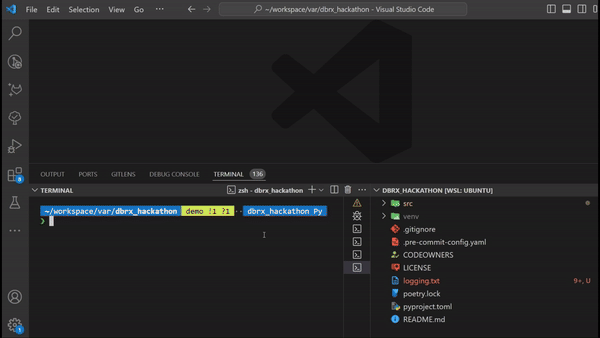

# CLHI



## Description

This repository contains the code and resources developed for the DAIS Hackathon.
CLHI (Say hi to your CLI!) is an AI-based terminal assistant that leverages natural language to provide answers to your questions regarding user guides for Linux terminal commands.

## Features

- **Problem Statements:** New users often spend a considerable amount of time getting acquainted with terminal commands. This project aims to make developers life easier.
- **Data Sets:** Check out the HuggingFace dataset for Linux Manual Pages, available at: https://huggingface.co/datasets/tmskss/linux-man-pages-tldr-summarized
- **Resources:** Databricks Workspace provided by DAIS organization for creating Vector Search index and endpoint. Implemented poetry for dependency management. Provided terminal history and conversation history as additianal context to the model as well.

## Setup

1. Clone the repository:
   ```bash
   git clone https://github.com/bulucyus/dais-hackathon.git
   ```
2. Navigate to the project directory:
   ```bash
   cd dais-hackathon
   ```
3. Install dependencies using Poetry:
   ```bash
   poetry install
   ```

## Usage

Say hi to your CLI:

```bash
hi
```

## License

This project is licensed under the Apache License 2.0.

## Contact

For inquiries or further information about the project, please contact [Bulut Ficici](mailto:bficici@lely.com) or [Tim Rietveld](mailto:trietveld@lely.com).

## Disclaimer

This README serves as a general guide to the contents and purpose of the repository. Please refer to the specific files and documentation within the repository for detailed instructions and information related to the hackathon.
